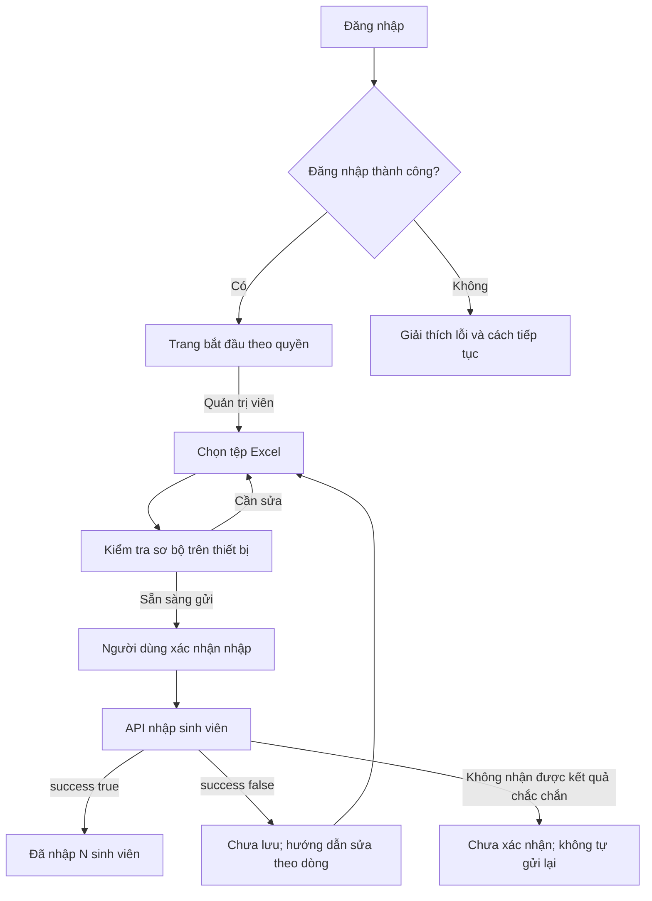
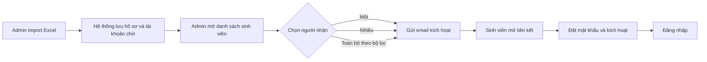

# 02 — Luồng sử dụng và đặc tả màn hình

[Về mục lục](README.md) · [Hợp đồng API](01-tinh-nang-va-hop-dong-api.md)

## 1. Nguyên tắc trải nghiệm

Người dùng cần trả lời được ba câu ở mọi màn hình: “Tôi đang làm gì?”, “Tôi cần làm gì tiếp?”, “Dữ liệu đã được lưu chưa?”. Thiết kế phải trả lời ngay trên trang, bằng ngôn ngữ công việc và trạng thái dễ nhìn.

1. Mỗi màn hình hoặc bước có một nút chính nổi bật. Nút ghi hành động cụ thể: “Đăng nhập”, “Kiểm tra tệp”, “Nhập 120 sinh viên”.
2. Chỉ hỏi dữ liệu thực sự cần. Không yêu cầu nhập lại email vừa có trong bước trước nếu còn trong bộ nhớ.
3. Cho biết điều kiện trước khi người dùng làm: định dạng, dung lượng, hai dòng tiêu đề, quyền nhập dữ liệu.
4. Hiện thông tin cơ bản trước; hướng dẫn dài và chi tiết lỗi mở khi cần.
5. Lỗi phải đi kèm cách sửa hoặc bước tiếp theo. Không chỉ hiện “Có lỗi xảy ra”.
6. Nút bị khóa phải có lời giải thích gần đó. Tính năng chưa được hỗ trợ không chiếm menu bằng một dãy mục mờ.
7. Không có bảng số liệu hoặc biểu đồ trang trí bằng dữ liệu giả. Chưa có API tổng quan thì trang đầu là nơi bắt đầu công việc.

## 2. Người dùng và điều hướng

| Nhóm | Việc hiện có | Điều hướng |
| --- | --- | --- |
| Chưa đăng nhập | Đăng nhập, yêu cầu email kích hoạt theo điều kiện phát hành | Trang đăng nhập đơn giản |
| Quản trị viên | Nhập sinh viên; đọc hướng dẫn; xem thông tin tài khoản từ login | Bắt đầu, Nhập sinh viên, Hướng dẫn |
| Sinh viên, giảng viên, giảng viên phụ trách | Chưa có API công việc riêng | Trang chào, hướng dẫn và thông tin tài khoản |

Không tự tạo trang nhóm, đăng ký học phần hoặc phân công giảng viên vì role đã tồn tại. Người có nhiều role thấy những tác vụ thực sự được phép; nhập sinh viên luôn cần có `ROLE_ADMIN`.

### Danh sách route frontend đề xuất

Các route sau là trang React, không phải endpoint backend.

| ID | Route | Trang | Quyền/điều kiện |
| --- | --- | --- | --- |
| S01 | `/login` | Đăng nhập | Public |
| S02 | `/verify-account` | Tài khoản đang chờ kích hoạt | Public; hướng dẫn liên hệ admin, không tự gọi API gửi mail |
| S03 | `/app` | Bắt đầu | Có phiên frontend; tác vụ theo role |
| S04 | `/app/students/import` | Nhập sinh viên qua ba bước | `ROLE_ADMIN` |
| S05 | Cùng route S04 | Kết quả nhập | State của lần nhập; không tạo URL giả có import ID |
| S06 | `/app/accounts/activation` | Gửi email hàng loạt | ĐỀ XUẤT mở sau các điều kiện trong 07 |
| S07 | `/app/help` | Hướng dẫn theo công việc | Có phiên; public có hướng dẫn ngay cạnh form |
| S08 | `/forbidden` | Không có quyền | Lối quay về trang bắt đầu |
| S09 | Route không khớp | Không tìm thấy trang | Lối về nơi hợp lệ theo phiên |
| S10 | `/account/activate` | Điểm đến liên kết email | Hiện hỗ trợ/chưa hoàn tất; không báo kích hoạt thành công khi thiếu API |

`/account/activate?key=...` là đường dẫn trong template email cục bộ đã thấy; cần xác minh URL triển khai vì resource này nằm trong thư mục bị gitignore. Frontend không log key, không gửi key lên analytics và không thử suy diễn endpoint xác nhận.

### Sơ đồ hành trình hiện có



### Hành trình cấp tài khoản mục tiêu



Sơ đồ này là hành trình sản phẩm cần đạt, không phải mô tả khả năng đang chạy. Backend hiện tại đã lưu activation key đúng cho gửi đơn/batch và yêu cầu quyền admin, nhưng chưa có danh sách để chọn, chưa có gửi toàn bộ và chưa có bước đặt mật khẩu/hoàn tất kích hoạt. Vì vậy UI chỉ được mở từng phần khi điều kiện ở 07 đã hoàn tất.

## 3. S01 — Đăng nhập

**Mục tiêu:** vào đúng công việc bằng email và mật khẩu, không cần hiểu role hoặc token.

**Bố cục:** card rộng khoảng 420 px ở giữa trang; tên sản phẩm; tiêu đề “Đăng nhập”; một câu hướng dẫn ngắn; hai trường; nút chính; liên kết trợ giúp. Không đặt banner quảng cáo, số liệu hay slideshow cạnh form.

| Thành phần | Hành vi |
| --- | --- |
| Email | Nhãn luôn hiển thị; kiểu email; cho phép dán; autocomplete phù hợp |
| Mật khẩu | Có nút “Hiện mật khẩu”/“Ẩn mật khẩu” với tên truy cập; hỗ trợ trình quản lý mật khẩu |
| Đăng nhập | Submit bằng Enter; khóa gửi lặp khi pending; nhãn “Đang đăng nhập…” |
| Trợ giúp | Hướng dẫn liên hệ người phụ trách; chỉ đưa địa chỉ liên hệ đã được cấu hình thật |
| Chưa kích hoạt | Chỉ hiện hướng dẫn tương ứng khi nhận mã đáng tin cậy hoặc người dùng tự chọn; không đoán từ 401 chung |

Kiểm tra email và mật khẩu khi rời trường hoặc submit; không báo đỏ khi người dùng vừa gõ ký tự đầu. Lỗi sai thông tin: “Email hoặc mật khẩu chưa đúng. Vui lòng kiểm tra lại.” Giữ email; không ghi mật khẩu vào storage, URL hoặc log. Mật khẩu chỉ tồn tại trong form đang mở, xóa khi rời form/kết thúc luồng.

Sau thành công, dùng ngay `user` trong response. Không gọi API `/me` tưởng tượng. Nếu có đường dẫn nội bộ cần quay lại và user đủ quyền, quay lại đó; ngược lại đến S03. Không nhận redirect ra domain bên ngoài.

Không đặt nút “Quên mật khẩu” dẫn tới chức năng giả; hiện “Cần hỗ trợ đăng nhập?” với hướng dẫn thực tế. Đăng ký tự phục vụ chưa có API nên không hiển thị.

## 4. S02 — Tài khoản đang chờ kích hoạt

API gửi email hiện yêu cầu `ROLE_ADMIN`; sinh viên không tự yêu cầu gửi lại qua màn hình này. Trang giải thích “Tài khoản của bạn đang chờ kích hoạt. Vui lòng kiểm tra email mới nhất hoặc liên hệ người phụ trách.” Không đưa người dùng vào vòng gọi API mà họ không có quyền.

**Bố cục:** cùng card S01, tiêu đề “Tài khoản chưa được kích hoạt”, email được điền từ bước trước nếu có và hướng dẫn kiểm tra hộp thư/thư rác. Không khẳng định danh tính tổ chức hoặc địa chỉ hỗ trợ khi chưa cấu hình thật.

Nút chính “Quay lại đăng nhập”; hành động phụ “Liên hệ người phụ trách” chỉ xuất hiện khi có thông tin hỗ trợ thật. Nhắc dùng liên kết trong email mới nhất vì admin gửi lại sẽ thay activation key cũ.

Không có bước hiển thị “Kích hoạt thành công” ở đây. Chỉ API hoàn tất activation trong tương lai mới được phép xác nhận trạng thái đó.

## 5. S03 — Trang bắt đầu

Quản trị viên thấy lời chào bằng tên/email, tiêu đề “Bạn muốn làm gì hôm nay?”, một thẻ chính “Nhập sinh viên từ Excel” và liên kết hướng dẫn. Không yêu cầu xem dashboard rồi tìm thao tác trong menu nhiều tầng.

```text
┌─────────────────────────────────────────────────────────┐
│ F Group Making                    Nguyễn An  · Tài khoản │
├──────────────┬──────────────────────────────────────────┤
│ Bắt đầu      │ Chào Nguyễn An                           │
│ Nhập SV      │ Chuẩn bị danh sách sinh viên             │
│ Hướng dẫn    │                                          │
│              │ [ Nhập sinh viên từ Excel ]              │
│              │ Chọn tệp, kiểm tra và xem kết quả.        │
│              │ [Bắt đầu nhập]     Xem cách chuẩn bị tệp │
└──────────────┴──────────────────────────────────────────┘
```

Trên giao diện thật ghi đầy đủ “Nhập sinh viên”; chữ viết tắt trong sơ đồ chỉ để vừa khung. Không hiển thị “Tổng sinh viên: 0” khi chưa có API tổng số. Có thể hiển thị tóm tắt lần nhập vừa xong trong phiên, nhưng phải ghi “Kết quả lần nhập vừa thực hiện”, không biến thành thống kê hệ thống hoặc lịch sử lâu dài.

Người không có quyền quản trị thấy: “Bạn đã đăng nhập. Hiện chưa có tác vụ được cung cấp cho vai trò của bạn.” Kèm thông tin tài khoản và hướng dẫn liên hệ. Đây là phản ánh phạm vi hiện tại, không phải thông báo lỗi quyền giả.

## 6. S04 — Nhập sinh viên: ba bước

### Bước 1 — Chọn tệp

Tiêu đề “Nhập sinh viên từ Excel”; mô tả “Hệ thống chỉ lưu danh sách khi các dòng đều hợp lệ.” Stepper chữ rõ: **1. Chọn tệp → 2. Kiểm tra → 3. Kết quả**.

- Có nút “Chọn tệp Excel”; kéo thả chỉ là cách bổ sung. Không bắt người dùng biết kéo thả.
- Ngay cạnh vùng chọn: “Tệp .xlsx, tối đa 5 MB. Dữ liệu ở trang tính đầu tiên, bắt đầu từ dòng 3.”
- Hiển thị tên, dung lượng tệp đã chọn, nút “Đổi tệp”. Chọn tệp chưa gọi API nhập.
- Hướng dẫn năm cột B–F nằm cạnh vùng chọn hoặc panel “Cách chuẩn bị tệp”.
- Tệp mẫu khi triển khai phải là bản sạch với hai dòng đầu, dữ liệu minh họa, cột đúng. Không xuất bản nguyên tệp sinh viên có sẵn trong repository. Hiện chưa có API tải mẫu và chưa có mẫu sạch được tạo trong lần viết tài liệu này.
- Nút chính “Kiểm tra tệp” chạy kiểm tra cục bộ, không gọi POST nhập chỉ để thử.

Tệp sai đuôi/rỗng/quá lớn được giải thích ngay cạnh vùng chọn. Nếu tệp có nhiều sheet, nhắc “Chỉ trang tính đầu tiên được sử dụng”; không tự cho chọn sheet khác rồi gửi nguyên tệp khiến server đọc khác preview.

### Bước 2 — Kiểm tra trước khi nhập

Preview đọc tệp trong trình duyệt. Dòng Excel và giá trị thể hiện phải khớp cách server đọc. Không chỉnh sửa trực tiếp trong bảng ở phiên bản đầu; người dùng sửa Excel rồi chọn lại, tránh lệch giữa nội dung nhìn thấy và byte tệp gửi.

Hiển thị:

- Tên tệp, sheet đầu tiên, số dòng dữ liệu được nhận diện.
- Bảng preview mặc định 20 dòng/trang: Dòng Excel, Mã sinh viên, Họ tên, Ngành, Mã thành viên, Email.
- Kết quả kiểm tra cục bộ như thiếu ô, trùng mã trong tệp, email không hợp lệ, tên quá dài, cột lệch. Ghi rõ đây là kiểm tra trên tệp; trùng database/ngành có tồn tại sẽ do máy chủ kiểm tra.
- Lời nhắc “Khi nhập, hệ thống tạo hồ sơ sinh viên và tài khoản liên quan. Tài khoản cần được kích hoạt và thiết lập trước khi sử dụng.”
- Nút phụ “Đổi tệp”; nút chính “Nhập N sinh viên” chỉ mở khi preview đủ tin cậy và không còn lỗi cục bộ chặn.

Nếu parser không thể đọc hoặc không đảm bảo đồng nhất với server, yêu cầu chuyển tệp về định dạng được hỗ trợ; không hiển thị “Sẵn sàng” dựa trên preview đoán. Tất cả điểm đọc Excel phải được kiểm thử bằng cùng tệp với backend.

Không thêm hộp thoại xác nhận lặp sau màn kiểm tra; việc bấm “Nhập N sinh viên” chính là xác nhận đã thấy tác động. Chỉ gửi **một** API-04 tại đây.

### Trong lúc nhập

Hiển thị “Đang gửi và kiểm tra danh sách…”, khóa nút nhập và đổi tệp. Nếu thư viện có tiến độ tải byte thật, có thể hiện “Đã gửi tệp X%”; tải xong chuyển sang “Đang xử lý trên hệ thống”. Không giả phần trăm lưu dữ liệu khi API không báo tiến độ.

Sau khoảng 10 giây, bổ sung “Việc này đang lâu hơn bình thường. Bạn có thể chờ thêm.” Không tự kết luận lỗi hoặc gửi lại. Giữ trạng thái chung nếu người dùng chuyển route trong ứng dụng. Khi rời hoàn toàn trang trong lúc request đang chạy, cảnh báo nguy cơ mất kết quả; không gọi “Hủy nhập” vì ngắt request không đồng nghĩa server rollback.

## 7. S05 — Kết quả nhập và phục hồi

### Đã nhập thành công

Tiêu đề **“Đã nhập N sinh viên”**, với N từ `totalImported`. Nút chính “Nhập tệp khác”; nút phụ “Về trang bắt đầu”. Không hiện nút “Xem danh sách” khi chưa có API đọc danh sách.

Tóm tắt này thuộc lần thao tác đang mở. Frontend có thể cho tải bản tóm tắt được tạo cục bộ, ghi rõ nguồn và thời điểm nhận kết quả; không gọi đó là biên nhận/lịch sử server. Không coi danh sách preview là xác nhận từng userId đã được server cấp.

### Dữ liệu cần sửa — HTTP 200 nhưng success=false

Tiêu đề **“Danh sách cần chỉnh sửa”**. Ngay dưới: “Chưa lưu sinh viên nào. Hãy sửa các dòng bên dưới rồi chọn lại tệp.” Đếm riêng **số lỗi** và **số dòng cần sửa** từ số dòng duy nhất; không nhầm một dòng có ba lỗi thành ba sinh viên.

| Cột bảng lỗi | Yêu cầu |
| --- | --- |
| Dòng Excel | Luôn hiển thị; sắp tăng dần mặc định |
| Thông tin sinh viên | Ưu tiên preview khớp dòng; không tin tuyệt đối `rollNumber` của lỗi email/memberCode |
| Cần sửa | Dịch field thành nhãn tiếng Việt |
| Lý do | Message an toàn dưới dạng text |
| Cách sửa | Hướng dẫn cụ thể theo loại lỗi; lỗi chưa biết dùng lời hướng dẫn chung |

Ví dụ: “Dòng 18 · Email · Chưa có email · Điền email vào ô F18”. Lỗi ngành: “Kiểm tra mã ngành ở ô D18; nếu mã đúng, liên hệ người phụ trách danh mục ngành.” Không tự sửa ngành sang một mã đoán.

Nút chính “Chọn tệp đã sửa”; nút phụ “Tải danh sách lỗi”. Tệp lỗi được tạo từ dữ liệu response trong trình duyệt, không cần endpoint xuất Excel. Nếu xuất CSV, bảo vệ ô có tiền tố công thức và giữ tiếng Việt; quy định này thuộc đầu ra có dữ liệu người dùng.

Có bộ lọc “Tất cả lỗi / Email / Mã sinh viên / Ngành…” để giảm nhiễu; mọi dòng vẫn có thể xem được. Không giấu toàn bộ lỗi trong toast tự biến mất.

### Chưa xác nhận được kết quả

Timeout, mất mạng hoặc phản hồi ngoài hợp đồng: **“Chưa xác nhận được kết quả nhập”**. Nội dung: “Kết nối bị gián đoạn khi hệ thống đang xử lý. Vui lòng nhờ người phụ trách kiểm tra kết quả trước khi nhập lại để tránh trùng dữ liệu.”

Giữ tên tệp, thời điểm gửi, số dòng preview và tệp trong bộ nhớ nếu trang còn mở. Cho “Xem thông tin lần gửi” để phục vụ hỗ trợ; không tự bật nút “Thử lại” gửi POST ngay. Hiện chưa có API đối soát nên không đặt nút kiểm tra trạng thái giả. Chỉ cho nhập lại khi kết quả đã được xác minh qua quy trình hỗ trợ, hoặc dùng tệp mới trong một thao tác mới có chủ ý.

### Hết phiên hoặc thiếu quyền

401 ở API bảo vệ: giải thích cần đăng nhập lại, giữ bản nháp trong bộ nhớ khi có thể. Đăng nhập lại ngay trong dialog dùng chung form S01, sau đó quay về màn kiểm tra; **người dùng bấm nhập lại**, không tự replay POST. 403: giữ trang kết quả lỗi quyền, cho quay lại bắt đầu; không đưa vào vòng đăng nhập lại.

## 8. S06 — Kích hoạt hàng loạt khi backend đủ điều kiện

**Trạng thái hiện tại: chưa mở.** Cần API danh sách có userId/trạng thái, sửa lưu activation key, quyền admin và bước hoàn tất kích hoạt.

Thiết kế đích:

1. Mở danh sách tài khoản chưa kích hoạt có tên/email để nhận diện; không hiển thị ID kỹ thuật.
2. Tìm theo tên, mã sinh viên hoặc email nếu API tìm kiếm hỗ trợ. Phân trang theo server.
3. Chọn người nhận. Ghi rõ “Đã chọn N người ở trang này”; không gọi chọn toàn hệ thống nếu chưa có contract.
4. Panel tóm tắt N người nhận và tác động tạo email mới. Nút “Gửi email cho N người”.
5. Gửi một batch ID đã xác thực; không mở N request email đơn.
6. HTTP thành công chỉ hiện “Đã tiếp nhận yêu cầu gửi cho N người”. N là số yêu cầu gửi, không phải số email đã giao.
7. Sau khi có API tiến trình, mới hiển thị số gửi thành công/lỗi và cho gửi lại đúng nhóm lỗi.

Luồng mở rộng sau import phải hỏi quản trị viên có muốn gửi email; không mặc định bật. Import thành công vẫn giữ nguyên kết quả nếu bước email thất bại. Chi tiết điều phối xem [05](05-phoi-hop-api.md).

## 9. Màn hình trợ giúp và trạng thái chung

S07 dùng hướng dẫn theo công việc, có hình minh họa/câu ngắn khi triển khai: chuẩn bị Excel, hiểu kết quả, sửa lỗi, đăng nhập lại. Hướng dẫn tại chỗ phải đủ để hoàn thành việc phổ biến mà không cần mở một tài liệu dài.

S08 ghi “Tài khoản này chưa có quyền thực hiện thao tác này”, nút “Về trang bắt đầu”. S09 ghi “Không tìm thấy trang này”, không tiết lộ URL nội bộ. S10 không tiêu thụ key hoặc báo thành công giả; chỉ đưa hướng dẫn hỗ trợ cho đến khi API xác nhận được cung cấp.

Menu tài khoản hiển thị tên/email, nhãn vai trò và “Đăng xuất”. Hiện tại hành động này chỉ kết thúc phiên frontend; hạn chế thu hồi server phải được xử lý trước khi tuyên bố hỗ trợ đăng xuất an toàn trên thiết bị dùng chung. Không đưa token/cookie vào nội dung trợ giúp người dùng.
