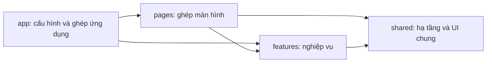

# 04 — Kiến trúc và cấu trúc React

[Về mục lục](README.md) · [Quy tắc triển khai](08-quy-tac-cho-nguoi-va-agent.md)

## 1. Quyết định kiến trúc

Đề xuất **ứng dụng React SPA dùng TypeScript, đóng gói bằng Vite**, gọi Spring REST. Ứng dụng hiện phục vụ thao tác sau đăng nhập, chưa có yêu cầu SEO hay render phía server. Lựa chọn này giữ frontend độc lập với Java và phù hợp phạm vi nhỏ hiện tại.

React khuyến nghị cân nhắc framework cho ứng dụng mới; tài liệu cũng mô tả cách xây từ đầu với Vite và bổ sung router/thư viện dữ liệu. Dự án chọn SPA có chủ đích, chấp nhận tự cấu hình routing, data và triển khai. Nếu xuất hiện nhu cầu SSR/SEO đáng kể, cần xem lại quyết định thay vì chồng thêm giải pháp tùy tiện. [Hướng dẫn chính thức của React](https://react.dev/learn/build-a-react-app-from-scratch).

**Không có một cây thư mục “chuẩn React” duy nhất.** Cây dưới đây là quy ước dự án theo cách tổ chức tính năng, tách UI khỏi điều phối và truy cập API. Các quy tắc React thực sự phải tuân thủ gồm tính thuần khi render, bất biến dữ liệu và quy tắc Hooks. [Rules of React](https://react.dev/reference/rules).

## 2. Stack thống nhất

| Nhu cầu | Lựa chọn | Ranh giới sử dụng |
| --- | --- | --- |
| UI | React + TypeScript strict | Function component, kiểu dữ liệu rõ |
| Build/dev | Vite | Cấu hình frontend, không chứa bí mật backend |
| Routing | React Router, Data Mode | Route, layout, guard UX, error boundary, lazy route |
| Tác vụ và dữ liệu server | TanStack Query | Mutation cho 4 POST hiện có; query/cache khi API đọc được bổ sung |
| HTTP | Một wrapper trên Fetch | Base URL, headers, body, unwrap, lỗi và timeout; không thêm Axios song song |
| Form | React Hook Form + Zod | Trạng thái form và kiểm tra dữ liệu; contract schema tách UI schema |
| UI kit | Material UI + theme qua Emotion | Một hệ thống Button/Input/Dialog/Table; không trộn nhiều bộ UI |
| Icon | MUI icons | Một phong cách xuyên suốt |
| Excel preview | Một adapter riêng trong feature import | Chọn thư viện đọc `.xlsx` có bảo trì/giấy phép phù hợp lúc triển khai; đánh giá khớp POI trước khi chốt |
| Kiểm thử | Vitest, React Testing Library, MSW, Playwright | Logic/interaction, mô phỏng hợp đồng, luồng trình duyệt |
| Chất lượng | ESLint với quy tắc React Hooks, TypeScript và formatter thống nhất | Kiểm tra import boundary, kiểu, định dạng |

Đây là lựa chọn của dự án, không phải tuyên bố mọi thư viện đều bắt buộc cho mọi ứng dụng React. React Router Data Mode cung cấp các cơ chế route/data/pending, nhưng ở dự án này TanStack Query là nơi duy nhất sở hữu trạng thái dữ liệu server. Loader chỉ làm điều hướng/chuẩn bị hoặc dùng lại query đã định nghĩa; không tạo bộ cache thứ hai. [Các mode của React Router](https://reactrouter.com/start/modes).

Zod cung cấp kiểm tra dữ liệu runtime có tích hợp TypeScript; dự án dùng schema ở biên API và form, không coi type tĩnh là xác nhận JSON từ server luôn đúng. [Tài liệu Zod](https://zod.dev/). React Hook Form được chọn để quản lý form; cần kiểm tra tương thích resolver và MUI khi khóa phiên bản, theo [repository chính thức](https://github.com/react-hook-form/react-hook-form).

Khi bắt đầu triển khai: chọn các bản stable tương thích theo tài liệu chính thức tại thời điểm đó, ghi chính xác phiên bản trong manifest và commit lockfile. Không lấy số phiên bản “latest” trong văn bản này làm ràng buộc bất biến. Đề xuất npm với một `package-lock.json`; không đồng thời duy trì nhiều lockfile. Chưa cài thư viện hoặc tạo manifest trong lần viết tài liệu.

## 3. Cây thư mục dự kiến

Đây là sơ đồ tổ chức, **các tệp dưới đây chưa được tạo**. Thư mục frontend mới dự kiến là `frontend/` ở gốc repository. Không đổi tên backend hiện có.

```text
frontend/
  public/
    templates/                  Mẫu Excel sạch, đã xác minh, khi được tạo
  src/
    app/
      providers/                Theme, QueryClient, session context
      router/                   Routes, route metadata, guards
      layouts/                  PublicLayout, AppShell
      config/                   Biến môi trường, capability flags
      styles/                   Global style và token/theme thống nhất
      App.tsx
    pages/
      login/
      verify-account/
      home/
      student-import/
      help/
      errors/                   Forbidden, NotFound, route error
    features/
      auth/
        api/                    Request login, contract response
        components/             LoginForm, SessionExpiredDialog
        hooks/                  Login mutation và điều phối auth
        model/                  Session, permission, schema
        index.ts                Public API của feature
      account-activation/
        api/                    Hợp đồng single/bulk đã tồn tại
        components/
        hooks/
        model/
        index.ts
      student-import/
        api/                    Upload contract, mapper kết quả
        components/             Preview, bảng lỗi, tóm tắt
        hooks/                  Điều phối wizard và mutation
        model/                  State machine, schema, field labels
        lib/                    Adapter đọc workbook, xuất lỗi
        index.ts
    shared/
      api/                      HTTP client, envelope, AppError
      ui/                       Thành phần dùng chung đã có nhu cầu thật
      lib/                      Format số/ngày, tiện ích thuần
      config/                   Hằng số hạ tầng dùng chung
      types/                    Kiểu thực sự dùng xuyên tính năng
    test/
      setup/                    Thiết lập kiểm thử
      fixtures/                 Dữ liệu giả bám đúng contract
      mocks/                    Handler MSW, chỉ dùng dev/test
    main.tsx
  e2e/                          Kịch bản người dùng
  package.json
  package-lock.json
  vite.config.ts
  tsconfig.json
```

Không tạo mọi thư mục rỗng để đủ sơ đồ; tạo khi có trách nhiệm cụ thể. `pages/accounts-activation/` chỉ thêm khi S06 được mở. Test nhỏ đặt cạnh module bằng hậu tố `.test.ts`/`.test.tsx`; fixture và mock dùng chung nằm trong `test/`.

## 4. Ranh giới phụ thuộc



Quy tắc bắt buộc:

1. `shared` không import ngược `features`, `pages` hoặc `app`.
2. Feature không import page, app hay nội bộ feature khác. Dùng public API của feature khi có nhu cầu thực sự; luồng phối hợp nhiều feature đặt ở page/hook điều phối cấp ứng dụng.
3. Module HTTP dùng cơ chế nhận token/session callback từ tầng cấu hình; không import `AuthContext` từ feature để tránh vòng phụ thuộc.
4. Page ghép thành phần và xử lý route. Quy tắc kiểm tra Excel, ánh xạ lỗi, payload và gọi API không nằm rải rác trong page.
5. Component hiển thị nhận props và phát sự kiện; hook nghiệp vụ điều phối state/request; module `api/` chứa hợp đồng và truy cập dữ liệu.
6. Chỉ `index.ts` của feature công bố phần cần dùng bên ngoài. Không làm barrel export khổng lồ cho toàn bộ `shared`.
7. Không tạo `utils.ts`, `services.ts` hoặc `components/` chung chứa mọi nghiệp vụ. Tên module nói rõ trách nhiệm.

## 5. Quyền sở hữu state

| Loại state | Nơi sở hữu | Ví dụ và giới hạn |
| --- | --- | --- |
| Tương tác cục bộ | `useState` gần component | Mở hướng dẫn, hiện mật khẩu |
| Quy trình nhiều trạng thái | `useReducer` hoặc model trạng thái rõ trong feature | Wizard import; không dùng nhiều boolean mâu thuẫn |
| Form | React Hook Form | Email, password; không copy sang global store |
| Tác vụ server | TanStack mutation | Pending/error/result của một lần POST |
| Dữ liệu server đọc | TanStack query, khi API tồn tại | Danh sách sinh viên tương lai; không sao chép sang Context/Redux |
| Bộ lọc cần chia sẻ URL | Search params, sau khi có màn danh sách | Trang, sort, filter; không đặt token hoặc dữ liệu cá nhân vào URL |
| Phiên | Auth/session model + context | Token và user tối thiểu theo chính sách 05 |
| Tệp và preview | Bộ nhớ của import workflow | Không lưu Excel/PII vào localStorage, sessionStorage hay query persistence |

Kết quả mutation được chuyển thành kết quả của workflow qua một bước rõ ràng; không duy trì hai phiên bản có thể tự sửa khác nhau. Muốn giữ trạng thái import khi đổi route nội bộ thì đặt workflow owner trong layout/module có vòng đời phù hợp, không đẩy tất cả state vào global store.

Tránh state trùng lặp và suy ra dữ liệu có thể tính được khi render, như số dòng lỗi duy nhất. Đây là áp dụng nguyên tắc cấu trúc state của React. [Choosing the State Structure](https://react.dev/learn/choosing-the-state-structure).

Chưa cần Redux hoặc Zustand ở phạm vi hiện tại. Chỉ bổ sung khi có nhu cầu chia sẻ state chưa được các lớp trên đáp ứng và có lý do được ghi lại.

## 6. Quy ước mã khi triển khai sau này

- Component và type dùng PascalCase; hook bắt đầu `use`; hàm/biến camelCase; thư mục feature dùng kebab-case.
- Dùng tiếng Anh cho identifier, tiếng Việt có dấu cho nội dung giao diện. Một từ điển nhãn dùng chung theo field/error, tránh mỗi trang dịch khác nhau.
- Function component và Hooks ở đúng cấp; không gọi Hooks có điều kiện, không mutate props/state, không tạo side effect khi render.
- POST chỉ bắt nguồn từ hành động người dùng qua mutation. Không đặt gửi mail/import trong `useEffect` hoặc loader chạy khi mở trang.
- Derived state tính từ nguồn gốc; effect dành cho đồng bộ với hệ thống ngoài khi cần, có cleanup.
- List dùng key ổn định: row Excel + vị trí lỗi phù hợp cho lỗi import; không tạo UUID mới mỗi render.
- TypeScript strict, không dùng `any` để bỏ qua lỗi. Dữ liệu bên ngoài bắt đầu là dữ liệu chưa tin cậy và được kiểm tra tại biên.
- DTO phía HTTP tách khỏi view model: `username` ánh xạ thành nhãn Email; `field` ánh xạ nhãn thân thiện; lỗi không lọt thẳng vào component dưới dạng JSON tùy ý.
- Số ID Java Long cần xác minh nằm trong phạm vi số nguyên an toàn của JavaScript. Nếu vượt, backend phải thống nhất ID dạng chuỗi; không để frontend parse số đã mất độ chính xác.
- Không ép `user.name` luôn có giá trị; có fallback. Không chấp nhận authority mới như quyền admin mặc định.
- Dùng một hệ thống theme; `sx` được dùng cho bố cục cục bộ theo token, không tạo bộ màu/cỡ chữ riêng từng màn.
- Không ghi endpoint hoặc base URL trong JSX. Không truy cập storage/token rải rác ngoài session layer.
- Memoization chỉ thêm khi có vấn đề đo được; không bọc mọi thứ bằng `useMemo`/`useCallback` theo thói quen.

## 7. Luồng dữ liệu chuẩn

**Người dùng thao tác → Form/component → hook nghiệp vụ → module API của feature → HTTP client chung → backend → kiểm tra hợp đồng/mapper → trạng thái nghiệp vụ → UI.**

Ví dụ nhập sinh viên: hook nhận tệp đã preview → gửi một mutation → client xử lý HTTP/envelope → import mapper phân biệt `success=true/false` → workflow chuyển sang kết quả phù hợp. HTTP 200 + false không phát thông báo thành công chung từ interceptor.

Một lỗi chỉ có một nơi sở hữu phản hồi giao diện. HTTP client chuẩn hóa, feature quyết định ngôn ngữ nghiệp vụ, page quyết định trình bày. Không đồng thời toast từ client, hook và page cho một lỗi.

## 8. Cấu hình, môi trường và triển khai

- Base URL đưa qua cấu hình frontend. Biến được Vite đưa vào bundle là công khai; chỉ chứa cấu hình, không chứa JWT secret, mật khẩu DB hoặc mail.
- Ưu tiên cùng origin qua reverse proxy `/api` trong môi trường triển khai, nhưng phải thống nhất với backend/infrastructure; đây là kiến trúc đề xuất, chưa có proxy được cấu hình.
- `CorsConfig` hiện cho localhost cổng 3000, 3001, 4173, 5173 và credentials. Domain production phải cấu hình riêng, không mặc định đã được phép.
- Cookie Secure/SameSite=Strict cần xác minh trên origin/scheme thật. Có credentials không có nghĩa browser sẽ luôn nhận/gửi cookie cross-site.
- Static hosting phải fallback các route React về trang ứng dụng; đường `/api` phải đi backend, không fallback thành HTML 200.
- Có trang lỗi route và fallback khi lazy module tải lỗi; nút tải lại không được tự gửi lại tác vụ ghi.
- Lazy load route import và thư viện đọc workbook để login gọn. Nếu parse tệp làm treo giao diện, đưa việc parse qua worker có tiến trình/hủy cục bộ; không cần tạo worker trước khi đo nhu cầu.
- Mock chỉ bật ở môi trường dev/test với dấu hiệu rõ; production không tự chuyển sang mock khi backend lỗi.
- Kiểm tra lint, typecheck, test hành vi cần thiết và production build khi triển khai. Tài liệu hiện tại không khẳng định các lệnh/kiểm tra này đã tồn tại hoặc đã chạy.

## 9. Hồ sơ quyết định

| ID | Quyết định ban đầu | Khi nào xem lại |
| --- | --- | --- |
| ADR-01 | React SPA + Vite bên cạnh Spring | Có SSR/SEO hoặc nền tảng triển khai mới |
| ADR-02 | Feature-based, phụ thuộc có hướng | Có nghiệp vụ dùng chung thật cần một lớp domain riêng |
| ADR-03 | TanStack cho API, form riêng, session riêng | State toàn ứng dụng phức tạp hơn |
| ADR-04 | Material UI, một theme và bộ icon | Yêu cầu thương hiệu không đáp ứng được bằng theme |
| ADR-05 | Session tạm trong sessionStorage, không refresh giả | Backend có `/me`, refresh, logout và policy phiên chính thức |
| ADR-06 | Import preview chỉ đọc, gửi đúng tệp đã chọn | Có nhu cầu chỉnh trực tiếp và contract upload dữ liệu chuẩn hóa |

Mỗi lần thay quyết định ghi: vấn đề, lựa chọn, lý do, ảnh hưởng, cách di chuyển, ngày áp dụng. Không thay stack hoặc cấu trúc âm thầm giữa các agent.
